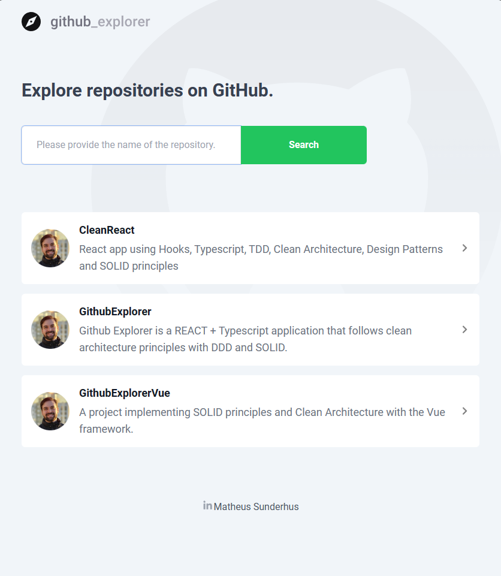
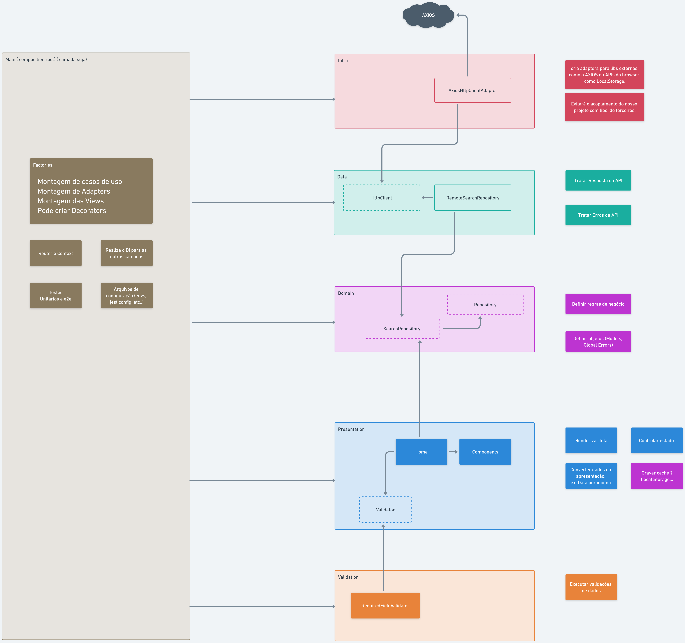

# Summary

1. **What is DDD:**
   This section explains the powerful concept of [Domain-Driven Design (DDD)](#what-is-ddd), a software development approach that focuses on understanding the business domain and designing software that reflects that understanding. You'll learn how DDD can help your project solve real-world problems and support business goals.

2. **Benefits of DDD in VUE:** This section dives into the [many benefits](#benefits-of-ddd-in-VUE) of using DDD in a VUE project. You'll discover how DDD can improve the organization of your code, create a shared language among stakeholders, increase flexibility to accommodate changes, and enhance testing.

3. **Project structure:** In this section, we showcase some [exciting project structure](#project-structure) to give you a taste of what's possible with a DDD approach in VUE. I encourage you to check out the `.github` folder for more images.

4. **Contact me:** [Matheus Sunderhus](#contact-me). You can reach me at LinkedIn or e-mail. Get in touch to learn more about how DDD can elevate your React,Angular,VUE,Astro,SolidJS project to the next level.

## To watch a demonstration of the React project that generates this migration to VUE [click here](https://youtu.be/3_w_MLb0zuU?si=s-26GebryxTBLA1q)

# Github Explorer VUE + DDD

Welcome to the DDD-powered VUE project! This Project is a real example of how to migrate really fast a project with React to VUE using DDD, SOLID and clean architecture.

  

## What is DDD?

DDD is a software development approach that focuses on understanding the business domain and designing software that reflects that understanding. By adopting DDD, you can create software that truly solves real-world problems and supports business goals.

In this project, we use DDD to organize code around domain models, and we emphasize the importance of a shared language among all stakeholders.

## Benefits of DDD in VUE

In this project, we use DDD to build a VUE application that is better organized, easier to maintain, and more flexible. Here are some of the benefits of using DDD in a VUE project:

- **Improved organization**: By focusing on domain models, we can create a clearer separation of concerns and a more organized codebase.
- **Clearer understanding of business requirements**: With DDD, all stakeholders speak the same language, which leads to a shared understanding of business requirements and a more effective software design.
- **Increased flexibility**: By separating domain logic from infrastructure concerns, we can create a more flexible and adaptable software architecture.
- **Improved testing**: With DDD, we can write more focused and effective tests, leading to higher quality software.

## Project structure

Check out these exciting ddd layer structure to get a taste of what's possible with a DDD approach in VUE. For more images, be sure to check out the `.github/images` folder.

## Contact Me

If you would like to learn more about DDD in VUE or have any questions about this project, please don't hesitate to get in touch with Matheus Sunderhus:

- Email: [matheus.sunderhus@gmail.com](mailto:matheus.sunderhus@gmail.com)
- LinkedIn: [Matheus Sunderhus](https://www.linkedin.com/in/matheus-sunderhus/)

We hope you enjoy exploring this project and learning more about the power of DDD in VUE!
